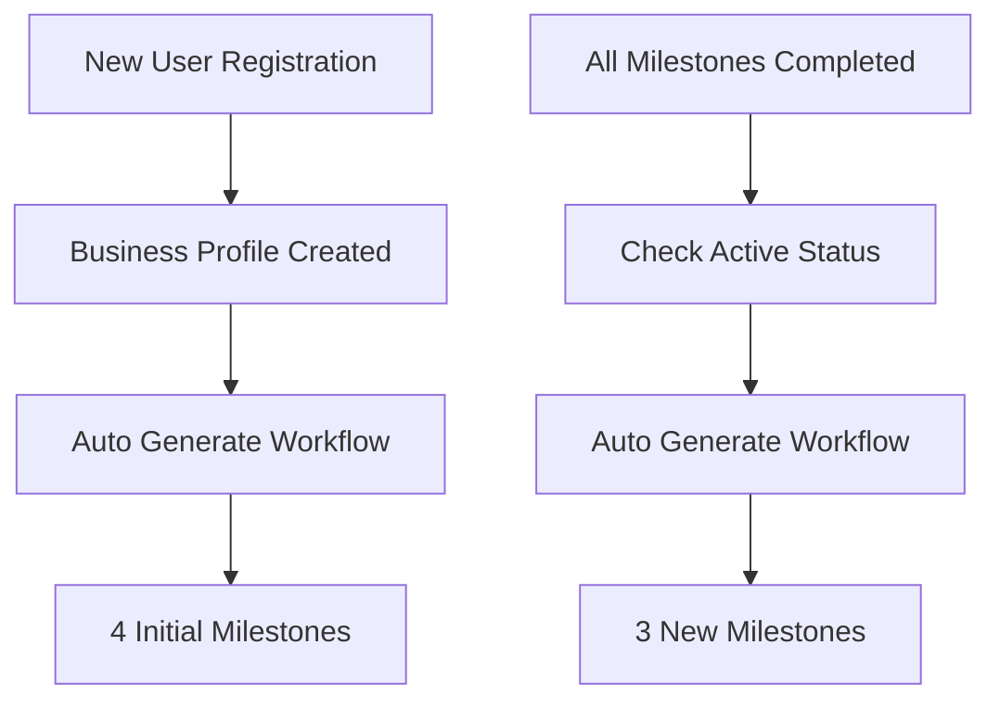
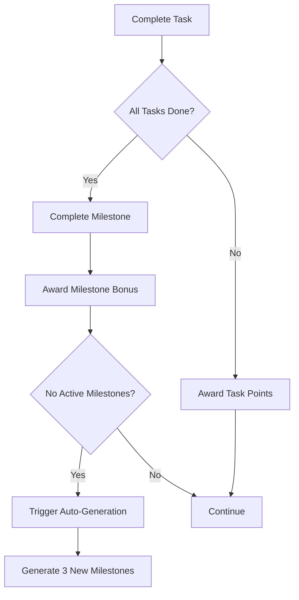
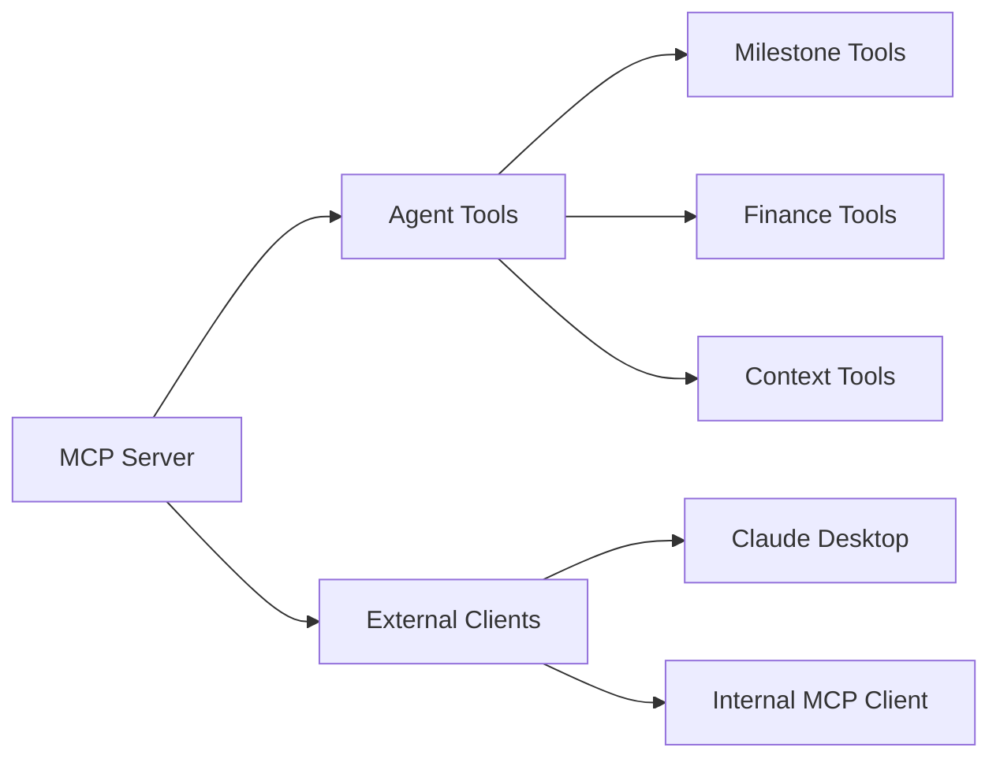
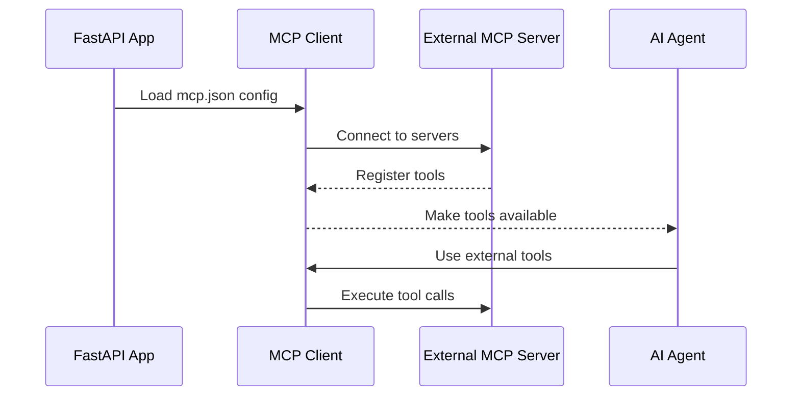

<div align="center">
  <h1>🤖 Agent & Main Documentation</h1>
  <p><em>AI workflows, tools, and MCP server integration</em></p>
</div>

---

## 📚 Table of Contents

- [🚀 AI Workflows](#-ai-workflows)
  - [🎯 Auto Generate Workflow](#-auto-generate-workflow)
  - [💬 Chat Workflow](#-chat-workflow)
- [🛠️ Agent Tools](#️-agent-tools)
  - [📌 Milestone Management](#-milestone-management)
  - [💰 Business & Finance](#-business--finance)
  - [🧠 Context Management](#-context-management)
- [🏁 Application Entry Points](#-application-entry-points)
  - [🚀 Main App](#-main-app-mainpy)
  - [🔗 MCP Server](#-mcp-server-mcp_serverpy)
  - [⚙️ External MCP Configuration](#️-external-mcp-configuration)

---

## 🚀 AI Workflows

> 🎯 **Purpose**: Intelligent automation and user guidance through AI-powered workflows

### 🎯 Auto Generate Workflow (`auto_generate_workflow`)

> **🤖 Agent**: `OnboardingAgent`  
> **👤 Role**: Senior Business Strategist

#### 🔧 Workflow Capabilities

| **Feature** | **Description** | **Output** |
|-------------|-----------------|------------|
| **Business Analysis** | Analyze user's business context and stage | Contextual understanding |
| **Initial Setup** | Generate **4 initial milestones** for new users | Onboarding roadmap |
| **Auto Refill** | Create **3 future milestones** when current ones complete | Continuous progression |
| **Logic Validation** | Ensure milestones follow actionable progression | Quality assurance |

#### 🔄 Workflow Trigger Points



---

### 💬 Chat Workflow (`get_chat_workflow`)

> **🤖 Agent**: `AdvisorAgent` (Telaten Advisor)  
> **👤 Role**: GPS Navigator & Business Manager

#### 🚀 Core Capabilities

| **Capability** | **Function** | **Tools Used** |
|----------------|--------------|----------------|
| **Roadmap Management** | View, update, modify milestones | `milestone_*_tool` |
| **Financial Assistant** | Record transactions, generate reports | `record_transaction_tool`, `get_financial_report_tool` |
| **Gamification** | Access points, levels, achievements | `get_business_summary_tool` |
| **Long-Term Memory** | Store user facts/constraints | `update_business_context_tool` |

#### 🎯 Behavior Rules

| **Rule** | **Description** | **Purpose** |
|----------|-----------------|-------------|
| **No Overload** | Cannot create new milestones if active ones exist | Prevent overwhelming users |
| **Re-Routing** | Suggests alternative plans when obstacles arise | Adaptive guidance |
| **Language Mode** | Defaults to Indonesian, switches to English on request | Localization support |

---

## 🛠️ Agent Tools

> 🏠 **Location**: `app/modules/agent/tools.py`  
> 🎯 **Purpose**: Async functions exposed to AI agents as operational tools

> **📝 Note**: All tools are automatically available to both `OnboardingAgent` and `AdvisorAgent`

### 📌 Milestone Management

| **Tool** | **Function** | **Auto-Triggers** |
|----------|--------------|-------------------|
| `create_milestone_tool` | Creates milestone with associated tasks | ✅ Gamification points |
| `list_milestones_tool` | Fetches milestones (filtered by status) | - |
| `start_milestone_tool` | Changes status: `pending` → `in_progress` | ✅ Progress tracking |
| `update_milestone_tool` | Updates description, status, reward points | ✅ Gamification updates |
| `complete_task_tool` | Marks task completed, auto-completes milestone | ✅ Points + Auto-generation |
| `delete_milestone_tool` | Soft-deletes milestone (requires confirmation) | ✅ Data integrity |

#### 🔄 Task Completion Flow



---

### 💰 Business & Finance

| **Tool** | **Function** | **Integration** |
|----------|--------------|-----------------|
| `get_business_summary_tool` | Returns gamification stats (points, level, achievements) | Real-time data |
| `record_transaction_tool` | Records income/expense transaction | +5 points automatically |
| `get_financial_report_tool` | Generates financial summary by period | Advanced analytics |
| `get_transaction_categories_tool` | Lists system + custom categories | Dynamic categorization |

#### 💳 Transaction Recording Benefits

- **🎯 Consistency Rewards**: +5 points per transaction
- **📊 Analytics**: Automatic financial health tracking
- **🔄 Integration**: Feeds into AI context for better advice

---

### 🧠 Context Management

#### 🔧 `update_business_context_tool`

> **🎯 Purpose**: Updates persistent AI memory in `business_profile.ai_context`

| **Field** | **Usage Example** | **Purpose** |
|-----------|-------------------|-------------|
| `current_focus` | "Expanding to new market" | Track business priorities |
| `financial_health` | "Cash flow improving" | Monitor financial status |
| `user_mood` | "Feeling overwhelmed" | Adjust communication style |
| `condition_update` | "Just hired a chef" | Remember important changes |
| `risk_factor` | "High competition area" | Identify potential challenges |

#### 🤫 Behavior Rules

| **Rule** | **Description** |
|----------|-----------------|
| **Silent Updates** | Do NOT announce context updates to user |
| **Smart Triggers** | Update when user reveals constraints/preferences |
| **Examples** | "I hate social media", "Budget is tight", "Team growing" |

---

## 🏁 Application Entry Points

> 🎯 **Purpose**: Core application setup and MCP server integration

### 🚀 Main App (`main.py`)

> **⚡ Framework**: FastAPI with async/await support

#### 🔧 Application Lifecycle

| **Phase** | **Action** | **Components** |
|-----------|------------|----------------|
| **Startup** | Initialize database and admin user | `init_db()`, `init_data()` |
| **Startup** | Initialize MCP Client for external tools | `MCPToolClient` |
| **Runtime** | Handle API requests via routers | All business modules |
| **Shutdown** | Clean up resources and connections | Graceful cleanup |

#### 🛣️ Router Integration

| **Router** | **Path** | **Purpose** |
|------------|----------|-------------|
| **Auth** | `/auth/*` | User authentication and registration |
| **Business** | `/business/*` | Business profiles and levels |
| **Milestone** | `/milestones/*` | Milestone and task management |
| **Chat** | `/chat/*` | AI chat conversations |
| **Gamification** | `/gamification/*` | Achievements and leaderboard |
| **Finance** | `/finance/*` | Financial tracking and reports |
| **MCP** | `/mcp/*` | Internal MCP server mount |

---

### 🔗 MCP Server (`mcp_server.py`)

> **📚 Library**: `mcp[fastmcp]`  
> **🎯 Purpose**: Expose internal logic as MCP-compliant server

#### 🌐 Server Endpoints

| **Endpoint** | **Protocol** | **Purpose** |
|--------------|--------------|-------------|
| `/mcp/sse` | Server-Sent Events | Real-time tool communication |
| `/mcp/tools` | HTTP | Tool discovery and metadata |

#### 🔧 Registered Tools



> **📝 Note**: All tools from `app.modules.agent.tools` are automatically exposed

---

### ⚙️ External MCP Configuration

> **📁 File**: `mcp.json` (see `mcp.json.example`)  
> **🎯 Purpose**: Configure connections to external MCP servers

#### 🔧 Configuration Structure

```json
{
  "mcpServers": {
    "server-name": {
      "command": "executable",
      "args": ["argument1", "argument2"],
      "env": {
        "ENV_VAR": "value"
      }
    }
  }
}
```

#### 📋 Example Servers

| **Server** | **Purpose** | **Command** |
|------------|-------------|-------------|
| `sequential-thinking` | Enhanced reasoning | `npx -y @modelcontextprotocol/server-sequential-thinking` |
| `filesystem` | File operations | `npx -y @modelcontextprotocol/server-filesystem` |
| `brave-search` | Web search | `npx -y @modelcontextprotocol/server-brave-search` |

#### 🔄 Integration Flow



---

<div align="center">
  <p><em>🤖 Agent system ready - AI-powered business automation at your service!</em></p>
</div>
