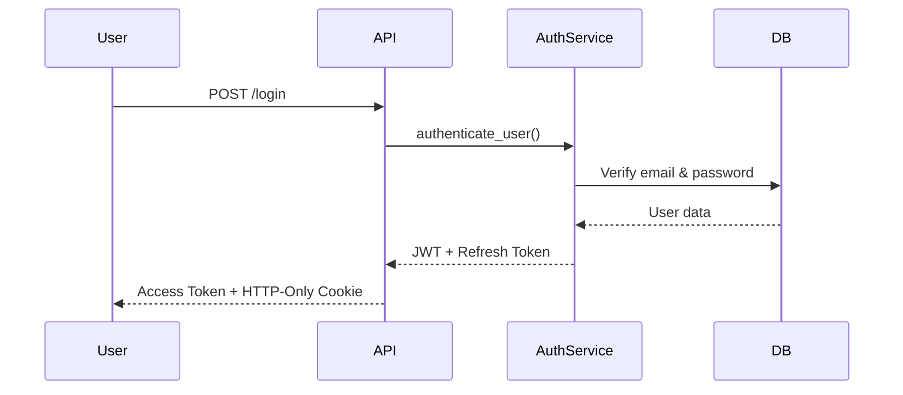
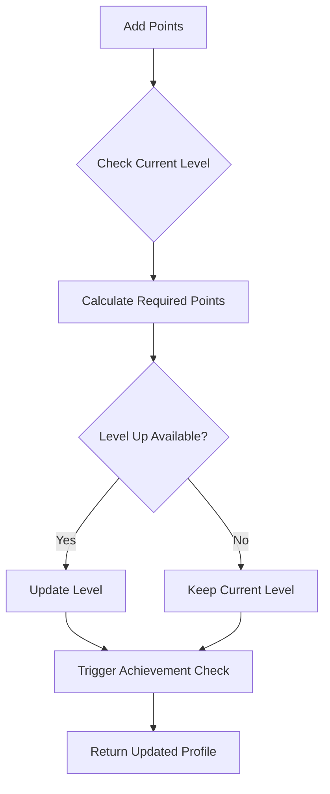
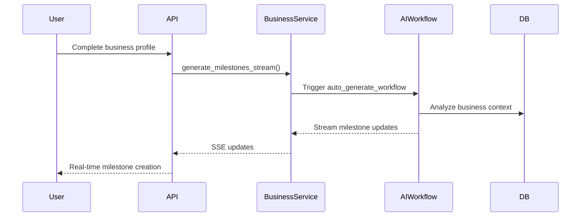
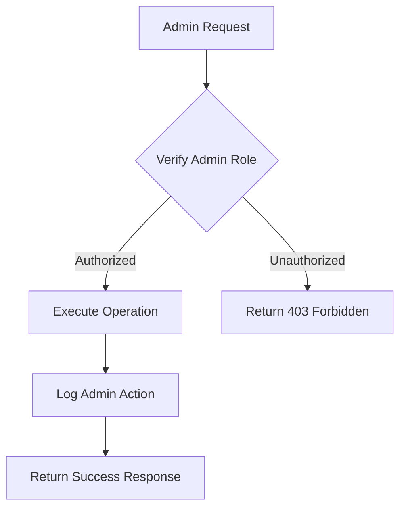

  <h1>🔐 Authentication & Business Documentation</h1>
  
<em>User management, business profiles, and gamification levels</em>

---

## 📚 Table of Contents

- [🔐 Authentication Module](#-authentication-module)
  - [🧩 User Models](#-user-models)
  - [⚙️ Auth Service](#️-auth-service)
- [🏢 Business Module](#-business-module)
  - [🧩 Business Models](#-business-models)
  - [⚙️ Business Service](#️-business-service)
- [🔧 Admin Module](#-admin-module)

---

# 🔐 Authentication Module

> 🏠 **Location**: `app/modules/auth/`  
> 🎯 **Purpose**: User registration, authentication, and role-based access control

## 🧩 User Models

### 👤 User Entity

> **📝 Note**: Primary user entity with secure authentication

#### 🔧 Core Fields

| **Field** | **Type** | **Description** | **Constraints** |
|-----------|----------|-----------------|-----------------|
| `id` | UUID | Primary key | Auto-generated |
| `email` | String | Unique login identifier | Unique, required |
| `name` | String | User's full name | Required |
| `hashed_password` | String | Securely hashed password | bcrypt hashed |
| `role` | String | User role | `"user"` (default), `"admin"` |
| `created_at` | DateTime | Account creation timestamp | Auto-generated |
| `updated_at` | DateTime | Last update timestamp | Auto-updated |

### 📋 Data Transfer Objects (DTOs)

> **🎯 Purpose**: Clean input/output schemas for API operations

| **DTO** | **Purpose** | **Fields** |
|---------|-------------|------------|
| `UserCreate` | Registration payload | `email`, `name`, `password` |
| `UserLogin` | Authentication payload | `email`, `password` |
| `UserRead` | Response model | `id`, `email`, `name`, `role`, `created_at` |

---

## ⚙️ Auth Service

### 🔧 `AuthService` Operations

| **Method** | **Purpose** | **Returns** | **Security Features** |
|------------|-------------|-------------|----------------------|
| `register_user` | Creates new account if email available | `UserRead` | Email uniqueness validation |
| `authenticate_user` | Validates credentials and issues tokens | `Access Token` + Cookie | bcrypt verification + JWT |
| `refresh_access_token` | Generates new access token from refresh token | `New Access Token` | Refresh token validation |

#### 🔒 Authentication Flow

#### 🍪 Token Strategy

| **Token Type** | **Storage** | **Expiry** | **Purpose** |
|----------------|-------------|------------|-------------|
| **Access Token** | Bearer Header | 60 minutes | API authentication |
| **Refresh Token** | HTTP-Only Cookie | 7 days | Token renewal |

---

# 🏢 Business Module

> 🏠 **Location**: `app/modules/business/`  
> 🎯 **Purpose**: Business profiles, gamification levels, and AI onboarding workflow

## 🧩 Business Models

### 🏪 BusinessProfile Entity

> **📝 Note**: Comprehensive business data storage with AI integration

#### 🔧 Core Business Fields

| **Field** | **Type** | **Purpose** | **Example** |
|-----------|----------|-------------|-------------|
| `business_name` | String | Company/brand name | "Warung Makan Sari" |
| `business_category` | String | Industry classification | "Food & Beverage" |
| `business_description` | Text | Detailed business overview | "Traditional Indonesian cuisine..." |
| `business_stage` | String | Development phase | "Startup", "Growth", "Established" |
| `target_market` | String | Customer demographics | "Local community, office workers" |
| `primary_goal` | String | Main business objective | "Increase daily revenue" |

#### 🎮 Gamification Fields

| **Field** | **Type** | **Purpose** | **Integration** |
|-----------|----------|-------------|-----------------|
| `total_points` | Integer | Accumulated gamification score | Achievement system |
| `level_id` | UUID (FK) | Current business level | Level progression |

#### 🤖 AI Integration Fields

| **Field** | **Type** | **Purpose** | **Example Data** |
|-----------|----------|-------------|------------------|
| `address` | JSON | Structured location data | `{"city": "Jakarta", "district": "..."}` |
| `ai_context` | JSON | Persistent AI memory | `{"current_focus": "marketing", "risks": [...]}` |

---

### 🏆 BusinessLevel Entity

> **🎯 Purpose**: Gamification tier system for business progression

#### 🔧 Level Structure

| **Field** | **Type** | **Description** | **Example** |
|-----------|----------|-----------------|-------------|
| `name` | String | Level display name | "Bronze Entrepreneur" |
| `required_points` | Integer | Points threshold | 100, 500, 1000, 2500 |
| `order` | Integer | Level sequence | 1, 2, 3, 4 |
| `icon` | String | Visual representation | "🥉", "🥈", "🥇", "💎" |

---

## ⚙️ Business Service

### 🔧 `BusinessService` Operations

| **Method** | **Purpose** | **Returns** | **Integration** |
|------------|-------------|-------------|-----------------|
| `get_profile` | Retrieve business profile with level info | `BusinessProfile` + `BusinessLevel` | Real-time data |
| `create_profile` | Create new business profile for user | `BusinessProfile` | Auto-level assignment |
| `update_profile` | Modify business details and information | Updated `BusinessProfile` | AI context update |
| `add_points` | Increase gamification points and check level-up | Points total + Level changes | Achievement system |

#### 🎮 Points & Level Management

### 🤖 AI Integration

#### 📡 `generate_milestones_stream`

> **🎯 Purpose**: AI-powered milestone generation with real-time updates

| **Feature** | **Technology** | **Output** |
|-------------|----------------|------------|
| **Workflow Invocation** | `auto_generate_workflow` | Tailored milestone set |
| **Real-time Updates** | Server-Sent Events (SSE) | Live generation progress |
| **Context Awareness** | Business data + AI memory | Personalized milestones |
| **Smart Triggers** | Profile completion detection | Automatic activation |

#### 🔄 AI Generation Flow

---

# 🔧 Admin Module

> 🏠 **Location**: `app/modules/business/admin_routes.py`  
> 🎯 **Purpose**: Restricted endpoints for system administrators

## ⚙️ Administrative Capabilities

### 🛠️ Business Management

| **Operation** | **Endpoint** | **Purpose** | **Access Level** |
|---------------|--------------|-------------|------------------|
| `get_all_businesses` | `GET /admin/businesses` | View all registered business profiles | Admin only |
| `delete_business` | `DELETE /admin/businesses/{id}` | Hard delete business profile + data | Admin only |

#### ⚠️ Security & Safety

| **Feature** | **Implementation** | **Purpose** |
|-------------|-------------------|-------------|
| **Role Verification** | `admin_required` dependency | Prevent unauthorized access |
| **Audit Logging** | Structured logs for all admin actions | Compliance and tracking |
| **Hard Deletion** | Complete data removal including related records | Data privacy compliance |

#### 🔄 Admin Operations Flow

> **🚨 Warning**: Admin operations are irreversible and will permanently delete all associated data including milestones, transactions, and chat history.

---

  
<em>🔐 Authentication & Business systems ready - Secure and scalable user management!</em>

