  <h1>🗄️ Entity Relationship Diagram</h1>
  
<em>Complete database schema and relationships for Telaten Backend</em>

---

## 📚 Database Overview

The Telaten Backend uses a **PostgreSQL** database with **SQLModel** for type-safe ORM operations. The schema supports:

- 👤 **User Management**: Authentication and role-based access
- 🏢 **Business Profiles**: Complete business information with gamification
- 🎯 **Milestone System**: AI-generated goals and task tracking  
- 💰 **Financial Tracking**: Transactions and category management
- 🏆 **Gamification**: Levels, achievements, and leaderboards
- 💬 **AI Chat**: Context-aware conversation sessions

---

## 🔗 Key Relationships

| **Relationship** | **Type** | **Purpose** |
|------------------|----------|-------------|
| User → BusinessProfile | One-to-One | Each user has one business |
| BusinessProfile → BusinessLevel | Many-to-One | Level progression system |
| BusinessProfile → Milestones | One-to-Many | Business milestone roadmap |
| Milestone → MilestoneTasks | One-to-Many | Granular task breakdown |
| BusinessProfile → Transactions | One-to-Many | Financial record keeping |
| User → UserAchievements | One-to-Many | Achievement tracking |
| BusinessProfile → ChatSessions | One-to-Many | AI conversation history |

---

## 📊 Entity Relationship Diagram

```mermaid
erDiagram
    User {
        UUID id PK
        string email
        string name
        string role
        string hashed_password
        datetime created_at
        datetime updated_at
        datetime deleted_at
    }

    BusinessProfile {
        UUID id PK
        UUID user_id FK
        UUID level_id FK
        string business_name
        string business_category
        string business_description
        json address
        string business_stage
        string target_market
        string primary_goal
        int total_points
        json ai_context
        datetime created_at
        datetime updated_at
        datetime deleted_at
    }

    BusinessLevel {
        UUID id PK
        string name
        int required_points
        int order
        string icon
        datetime created_at
    }

    Milestone {
        UUID id PK
        UUID business_id FK
        string title
        string description
        string status
        int order
        bool is_generated
        int level
        int reward_points
        datetime created_at
        datetime updated_at
        datetime started_at
        datetime completed_at
        datetime deleted_at
    }

    MilestoneTask {
        UUID id PK
        UUID milestone_id FK
        string title
        bool is_completed
        int order
        int reward_points
        datetime created_at
        datetime updated_at
        datetime completed_at
    }

    Transaction {
        UUID id PK
        UUID business_id FK
        float amount
        string type
        string category
        UUID category_id FK
        string payment_method
        string description
        datetime transaction_date
        datetime created_at
    }

    TransactionCategory {
        UUID id PK
        UUID business_id FK
        string name
        string type
        string icon
        bool is_default
        datetime created_at
    }

    Achievement {
        UUID id PK
        string title
        string description
        int required_points
        string badge_icon
        datetime created_at
    }

    UserAchievement {
        UUID id PK
        UUID user_id FK
        UUID achievement_id FK
        datetime unlocked_at
    }

    ChatSession {
        UUID id PK
        UUID business_id FK
        string title
        datetime created_at
        datetime deleted_at
    }

    ChatMessage {
        UUID id PK
        UUID session_id FK
        string role
        string content
        datetime created_at
        datetime deleted_at
    }

    %% Relationships
    User ||--o| BusinessProfile : "has one"
    User ||--o{ UserAchievement : "earns"
    
    BusinessProfile }|--|| BusinessLevel : "belongs to level"
    BusinessProfile ||--o{ Milestone : "has milestones"
    BusinessProfile ||--o{ Transaction : "records"
    BusinessProfile ||--o{ TransactionCategory : "owns custom categories"
    BusinessProfile ||--o{ ChatSession : "has sessions"

    Milestone ||--o{ MilestoneTask : "contains"

    Transaction }|--o| TransactionCategory : "categorized by"

    Achievement ||--o{ UserAchievement : "unlocked by"

    ChatSession ||--o{ ChatMessage : "contains"
```

---

## 📋 Entity Details

### 👤 Core Entities

#### **User**
- **Purpose**: Central authentication and user management
- **Key Features**: Role-based access (`user`/`admin`), secure password hashing
- **Relationships**: One business profile, multiple achievements

#### **BusinessProfile** 
- **Purpose**: Complete business information with AI integration
- **Key Features**: Gamification points, AI context storage, level progression
- **Relationships**: Hub entity connecting to milestones, transactions, chat sessions

### 🎯 Progress Tracking

#### **Milestone & MilestoneTask**
- **Purpose**: AI-generated business goals with granular task breakdown
- **Key Features**: Status tracking, reward points, AI generation flags
- **Workflow**: Pending → In Progress → Completed (auto-progression)

#### **BusinessLevel**
- **Purpose**: Gamification tier system for business advancement  
- **Key Features**: Point thresholds, visual icons, ordered progression
- **Integration**: Automatically updated based on total points

### 💰 Financial Management

#### **Transaction & TransactionCategory**
- **Purpose**: Comprehensive financial tracking with flexible categorization
- **Key Features**: System defaults + custom categories, gamification rewards
- **Analytics**: Period-based summaries and category breakdowns

### 🏆 Gamification System

#### **Achievement & UserAchievement**
- **Purpose**: Badge system for milestone recognition
- **Key Features**: Point thresholds, one-time unlocks, visual badges
- **Motivation**: Leaderboard integration and progress celebration

### 💬 AI Communication

#### **ChatSession & ChatMessage**
- **Purpose**: Context-aware AI conversations with business integration
- **Key Features**: Session organization, role-based messages, persistent memory
- **Intelligence**: Business context injection and tool execution

---

## 🔧 Technical Implementation Notes

### **Data Types & Constraints**
- **UUIDs**: Primary keys for all entities (better for distributed systems)
- **JSON Fields**: Flexible schema for `address` and `ai_context`
- **Soft Deletion**: `deleted_at` timestamps preserve data integrity
- **Timestamps**: Comprehensive audit trail with `created_at`/`updated_at`

### **Performance Considerations**
- **Indexes**: Strategic indexing on foreign keys and query-heavy fields
- **Relationships**: Optimized for common query patterns (business-centric views)
- **Pagination**: Built-in support for large dataset handling

### **Security Features**
- **Role-Based Access**: User/Admin separation with proper authorization
- **Data Isolation**: Business-scoped data access (users only see their data)
- **Audit Trail**: Complete activity logging with timestamps

---

  
<em>🗄️ Database schema complete - Robust foundation for AI-powered business growth!</em>

