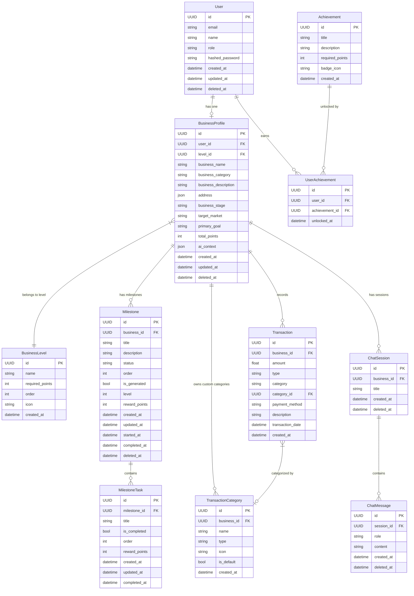

```mermaid
erDiagram
    User {
        UUID id PK
        string email
        string name
        string role
        string hashed_password
        datetime created_at
        datetime updated_at
        datetime deleted_at
    }

    BusinessProfile {
        UUID id PK
        UUID user_id FK
        UUID level_id FK
        string business_name
        string business_category
        string business_description
        json address
        string business_stage
        string target_market
        string primary_goal
        int total_points
        json ai_context
        datetime created_at
        datetime updated_at
        datetime deleted_at
    }

    BusinessLevel {
        UUID id PK
        string name
        int required_points
        int order
        string icon
        datetime created_at
    }

    Milestone {
        UUID id PK
        UUID business_id FK
        string title
        string description
        string status
        int order
        bool is_generated
        int level
        int reward_points
        datetime created_at
        datetime updated_at
        datetime started_at
        datetime completed_at
        datetime deleted_at
    }

    MilestoneTask {
        UUID id PK
        UUID milestone_id FK
        string title
        bool is_completed
        int order
        int reward_points
        datetime created_at
        datetime updated_at
        datetime completed_at
    }

    Transaction {
        UUID id PK
        UUID business_id FK
        float amount
        string type
        string category
        UUID category_id FK
        string payment_method
        string description
        datetime transaction_date
        datetime created_at
    }

    TransactionCategory {
        UUID id PK
        UUID business_id FK
        string name
        string type
        string icon
        bool is_default
        datetime created_at
    }

    Achievement {
        UUID id PK
        string title
        string description
        int required_points
        string badge_icon
        datetime created_at
    }

    UserAchievement {
        UUID id PK
        UUID user_id FK
        UUID achievement_id FK
        datetime unlocked_at
    }

    ChatSession {
        UUID id PK
        UUID business_id FK
        string title
        datetime created_at
        datetime deleted_at
    }

    ChatMessage {
        UUID id PK
        UUID session_id FK
        string role
        string content
        datetime created_at
        datetime deleted_at
    }

    %% Relationships
    User ||--o| BusinessProfile : "has one"
    User ||--o{ UserAchievement : "earns"
    
    BusinessProfile }|--|| BusinessLevel : "belongs to level"
    BusinessProfile ||--o{ Milestone : "has milestones"
    BusinessProfile ||--o{ Transaction : "records"
    BusinessProfile ||--o{ TransactionCategory : "owns custom categories"
    BusinessProfile ||--o{ ChatSession : "has sessions"

    Milestone ||--o{ MilestoneTask : "contains"

    Transaction }|--o| TransactionCategory : "categorized by"

    Achievement ||--o{ UserAchievement : "unlocked by"

    ChatSession ||--o{ ChatMessage : "contains"
```
