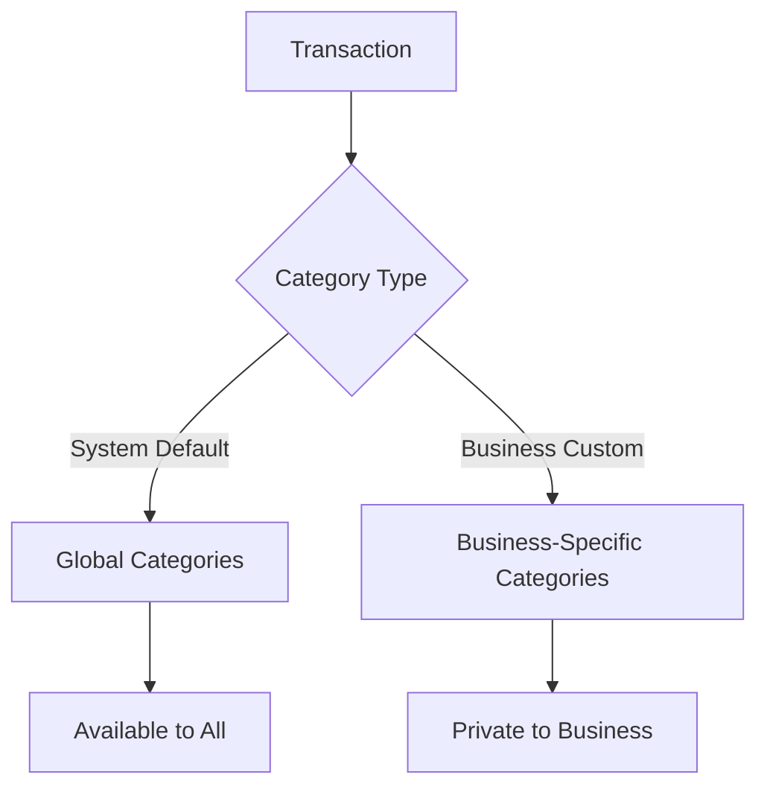
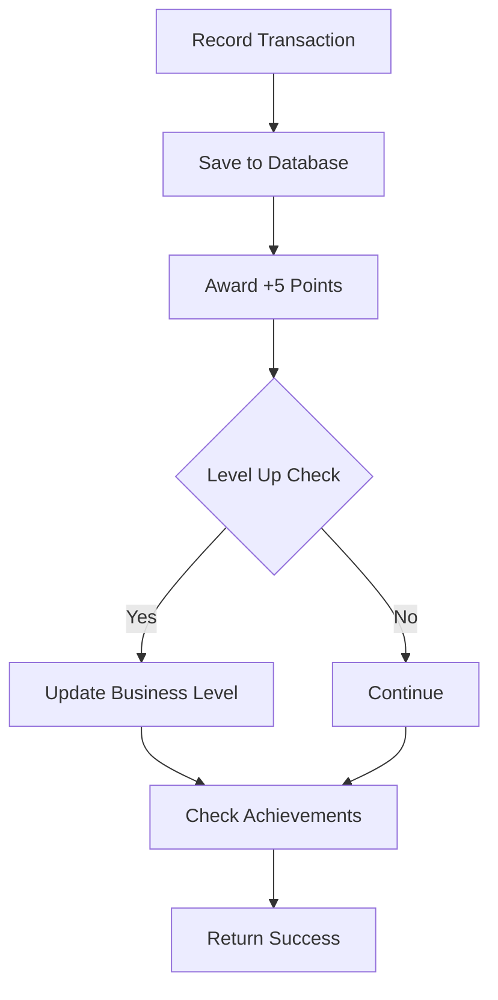
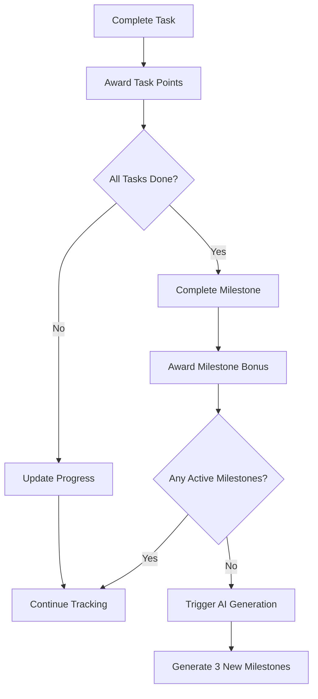
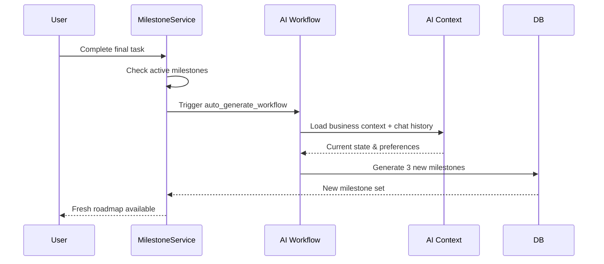

  <h1>💰 Finance & Milestone Documentation</h1>
  
<em>Financial tracking, transaction management, and milestone progression</em>

---

## 📚 Table of Contents

- [💰 Finance Module](#-finance-module)
  - [🧩 Financial Models](#-financial-models)
  - [⚙️ Finance Service](#️-finance-service)
- [🎯 Milestone Module](#-milestone-module)
  - [🧩 Milestone Models](#-milestone-models)
  - [⚙️ Milestone Service](#️-milestone-service)

---

# 💰 Finance Module

> 🏠 **Location**: `app/modules/finance/`  
> 🎯 **Purpose**: Comprehensive financial tracking with transaction recording, summaries, and category management

## 🧩 Financial Models

### 🏷️ TransactionCategory Entity

> **📝 Note**: Flexible categorization system supporting both system defaults and custom business categories

#### 🔧 Core Fields

| **Field** | **Type** | **Description** | **Example** |
|-----------|----------|-----------------|-------------|
| `name` | String | Category display name | "Food & Beverage", "Marketing" |
| `type` | Enum | Transaction type | `income`, `expense` |
| `icon` | String | Visual representation | "🍽️", "📢", "💼" |
| `is_default` | Boolean | System vs custom category | `true` for system defaults |
| `business_id` | UUID (nullable) | Owner business (null = system default) | `null` or specific business UUID |

#### 🏗️ Category Architecture

| **Category Type** | **business_id** | **Availability** | **Examples** |
|-------------------|-----------------|------------------|--------------|
| **System Default** | `null` | Available to all businesses | "Food & Beverage", "Transportation", "Marketing" |
| **Business Custom** | Specific UUID | Only for that business | "Bakery Ingredients", "Delivery Service" |

#### 🔗 Relationship Flow

---

### 💳 Transaction Entity

> **🎯 Purpose**: Individual financial record storage with comprehensive tracking

#### 🔧 Transaction Fields

| **Field** | **Type** | **Description** | **Example** |
|-----------|----------|-----------------|-------------|
| `amount` | Decimal(12,2) | Transaction value | 150000.50 |
| `type` | Enum | Transaction direction | `income`, `expense` |
| `category` | String | Category name (denormalized) | "Food & Beverage" |
| `category_id` | UUID (FK) | Reference to TransactionCategory | Links to category |
| `payment_method` | String | Payment type | "cash", "transfer", "e-wallet" |
| `transaction_date` | DateTime | When transaction occurred | User-specified date |
| `description` | String | Transaction details | "Lunch sales - 15 portions" |
| `business_id` | UUID (FK) | Owner business profile | Links to business |

---

## ⚙️ Finance Service

### 🔧 `FinanceService` Operations

| **Method** | **Purpose** | **Returns** | **Gamification** |
|------------|-------------|-------------|------------------|
| `create_transaction` | Records financial transaction | `Transaction` object | +5 points automatically |
| `get_transactions` | Retrieve paginated transaction history | List of transactions | - |
| `get_summary` | Generate financial analytics by period | Summary statistics | - |
| `manage_categories` | Create, list, delete custom categories | Category operations | - |

#### 💳 Transaction Recording Benefits

#### 📊 Financial Summary Features

| **Period** | **Metrics Included** | **Analytics** |
|------------|---------------------|---------------|
| **Daily** | Income, Expense, Net Profit | Day-over-day comparison |
| **Weekly** | 7-day rolling summary | Weekly trends |
| **Monthly** | Calendar month totals | Month-over-month growth |
| **Yearly** | Annual financial overview | Year-over-year analysis |

#### 🏷️ Category Management

| **Operation** | **Scope** | **Usage** |
|---------------|-----------|-----------|
| **System Categories** | Global (all businesses) | Pre-defined industry standards |
| **Custom Categories** | Business-specific | Tailored to business needs |
| **Category Analytics** | Per-category breakdown | Spending/income patterns |

---

# 🎯 Milestone Module

> 🏠 **Location**: `app/modules/milestone/`  
> 🎯 **Purpose**: Business milestone management, actionable steps, and progress tracking

## 🧩 Milestone Models

### 🎯 Milestone Entity

> **📝 Note**: Represents major business goals or growth phases with AI integration

#### 🔧 Core Fields

| **Field** | **Type** | **Description** | **Example** |
|-----------|----------|-----------------|-------------|
| `title` | String | Milestone name | "Launch Online Presence" |
| `description` | Text | Detailed milestone explanation | "Create social media accounts and website..." |
| `status` | Enum | Current progress state | `pending`, `in_progress`, `completed` |
| `order` | Integer | Sequence in roadmap | 1, 2, 3, 4 |
| `level` | Integer | Difficulty/complexity | 1 (basic) to 5 (advanced) |
| `reward_points` | Integer | Completion bonus | 50, 100, 200 points |

#### 🤖 AI Integration Fields

| **Field** | **Type** | **Description** | **Purpose** |
|-----------|----------|-----------------|-------------|
| `is_generated` | Boolean | AI vs manual creation | Track AI-generated milestones |
| `started_at` | DateTime | When work began | Progress tracking |
| `completed_at` | DateTime | When milestone finished | Achievement timing |
| `tasks` | Relationship | Associated sub-tasks | Granular progress |

---

### ✅ MilestoneTask Entity

> **🎯 Purpose**: Granular sub-tasks within milestones for detailed progress tracking

#### 🔧 Task Structure

| **Field** | **Type** | **Description** | **Example** |
|-----------|----------|-----------------|-------------|
| `title` | String | Task name | "Create Instagram business account" |
| `is_completed` | Boolean | Completion status | `true`, `false` |
| `order` | Integer | Task sequence | 1, 2, 3, 4 |
| `reward_points` | Integer | Task completion points | 5, 10, 15 points |

---

## ⚙️ Milestone Service

### 🔧 `MilestoneService` Operations

| **Method** | **Purpose** | **Trigger** | **Auto-Actions** |
|------------|-------------|-------------|-------------------|
| `start_milestone` | Begin working on milestone | User action | Status: `pending` → `in_progress` |
| `complete_task` | Mark individual task done | User/AI action | Points award + auto-completion check |
| `update_milestone` | Modify milestone details | User/AI action | Progress tracking |
| `delete_milestone` | Soft-delete milestone | User action | Data integrity preservation |

#### ✅ Task Completion Logic

#### 🔄 Auto-Completion Features

| **Trigger** | **Action** | **Bonus** | **Next Step** |
|-------------|------------|-----------|---------------|
| **Task Complete** | Award task points | 5-15 points | Progress update |
| **All Tasks Done** | Complete milestone | 50-200 points | Milestone bonus |
| **No Active Milestones** | Trigger AI generation | - | Create new roadmap |

### 🤖 AI Integration

#### 📡 `_check_and_trigger_generation`

> **🎯 Purpose**: Intelligent milestone pipeline management with AI-powered generation

| **Feature** | **Function** | **Integration** |
|-------------|--------------|-----------------|
| **Active Monitoring** | Tracks completion status of all milestones | Real-time progress |
| **Smart Triggering** | Detects when new milestones are needed | Zero active milestone detection |
| **Context Awareness** | Uses AI memory + recent chat history | Personalized generation |
| **Seamless Flow** | Automatic generation prevents roadmap gaps | Continuous progression |

#### 🔄 AI Generation Trigger Flow

#### 🧠 Context Integration

| **Data Source** | **Usage** | **Impact** |
|-----------------|-----------|------------|
| **Business Profile** | Industry, stage, goals | Milestone relevance |
| **AI Memory** | User preferences, constraints | Personalization |
| **Chat History** | Recent conversations | Current focus areas |
| **Progress Analytics** | Completion patterns | Difficulty calibration |

---

  
<em>💰🎯 Finance & Milestone systems integrated - Smart business growth tracking!</em>

