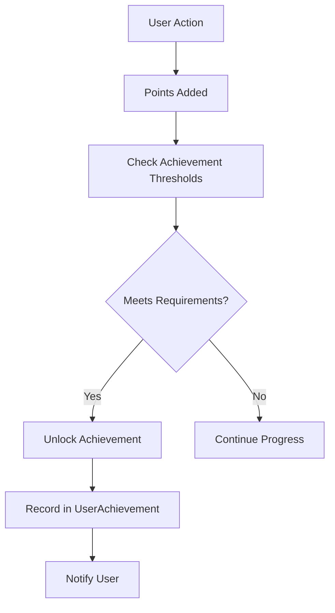
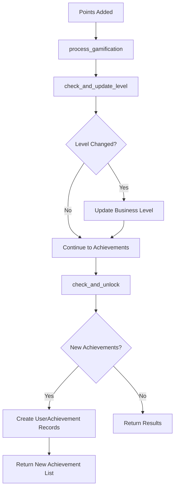
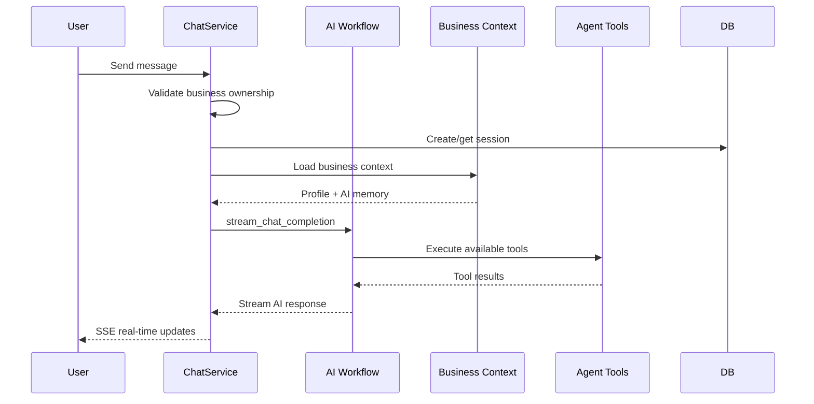

  <h1>🏆 Gamification & Chat Documentation</h1>
  
<em>Achievements, leaderboards, and AI-powered chat system</em>

---

## 📚 Table of Contents

- [🏆 Gamification Module](#-gamification-module)
  - [🧩 Gamification Models](#-gamification-models)
  - [⚙️ Gamification Service](#️-gamification-service)
  - [🔧 Gamification Admin](#-gamification-admin)
- [💬 Chat Module](#-chat-module)
  - [🧩 Chat Models](#-chat-models)
  - [⚙️ Chat Service](#️-chat-service)

---

# 🏆 Gamification Module

> 🏠 **Location**: `app/modules/gamification/`  
> 🎯 **Purpose**: Achievement system, business levels, and leaderboard management for user engagement

## 🧩 Gamification Models

### 🎖️ Achievement Entity

> **📝 Note**: Predefined badges and milestones that users can unlock

#### 🔧 Achievement Structure

| **Field** | **Type** | **Description** | **Example** |
|-----------|----------|-----------------|-------------|
| `title` | String | Achievement name | "First Sale", "Milestone Master" |
| `description` | Text | Achievement details | "Record your first transaction" |
| `required_points` | Integer | Points threshold to unlock | 10, 50, 100, 500 |
| `badge_icon` | String | Visual representation | "🥇", "💰", "🎯", "🚀" |

---

### 🏅 UserAchievement Entity

> **🎯 Purpose**: Junction table tracking which achievements users have unlocked

#### 🔧 Mapping Structure

| **Field** | **Type** | **Description** | **Purpose** |
|-----------|----------|-----------------|-------------|
| `user_id` | UUID (FK) | Reference to User | Links to user account |
| `achievement_id` | UUID (FK) | Reference to Achievement | Links to specific achievement |
| `unlocked_at` | DateTime | When achievement was earned | Progress tracking |

#### 🏆 Achievement Unlock Flow

---

### 📊 LeaderboardEntry DTO

> **🎯 Purpose**: Data transfer object for leaderboard display

#### 🔧 Leaderboard Fields

| **Field** | **Type** | **Description** | **Example** |
|-----------|----------|-----------------|-------------|
| `rank` | Integer | Position in leaderboard | 1, 2, 3, ... |
| `business_name` | String | Business display name | "Warung Sari Rasa" |
| `total_points` | Integer | Accumulated points | 1,250 points |
| `level_name` | String | Current business level | "Silver Entrepreneur" |
| `user_name` | String | Owner name | "Sari Dewi" |
| `achievements_count` | Integer | Number of unlocked achievements | 8 achievements |

---

## ⚙️ Gamification Service

### 🔧 `GamificationService` Operations

| **Method** | **Purpose** | **Trigger** | **Returns** |
|------------|-------------|-------------|-------------|
| `process_gamification` | Evaluate level upgrades & new achievements | Points awarded | List of new achievement titles |
| `check_and_update_level` | Update business level based on points | Point accumulation | Level changes |
| `check_and_unlock` | Check and unlock eligible achievements | Internal process | New achievements |
| `get_leaderboard` | Retrieve top-ranked businesses | API request | Ranked business list |

#### 🎮 Gamification Processing Flow

#### 🏆 Level & Achievement Concepts

| **System** | **Type** | **Behavior** | **Examples** |
|------------|----------|--------------|--------------|
| **Business Levels** | Tier-based progression | Upgradeable (Level 1 → 2 → 3) | Bronze → Silver → Gold → Platinum |
| **Achievements** | One-time unlocks | Permanent badges at thresholds | "First Sale" (10 pts), "Power User" (500 pts) |

#### 📈 Leaderboard Features

| **Feature** | **Function** | **Sorting** |
|-------------|--------------|-------------|
| **Global Ranking** | Top businesses by points | Descending point order |
| **User Position** | Include current user's rank | Relative positioning |
| **Rich Data** | Business name, level, achievements | Complete profile info |

---

## 🔧 Gamification Admin

> 🏠 **Location**: `app/modules/gamification/admin_routes.py`  
> 🎯 **Purpose**: Administrative configuration of gamification elements

### ⚙️ Admin Capabilities

| **Operation** | **Endpoint** | **Purpose** | **Access** |
|---------------|--------------|-------------|------------|
| `create_achievement` | `POST /admin/achievements` | Add new unlockable achievements | Admin only |
| `update_achievement` | `PUT /admin/achievements/{id}` | Modify existing achievements | Admin only |
| `delete_achievement` | `DELETE /admin/achievements/{id}` | Remove achievements from system | Admin only |
| `create_level` | `POST /admin/levels` | Define new business tiers | Admin only |

#### 🛡️ Security & Validation

- **Role-based Access**: Admin-only endpoints with proper authorization
- **Data Validation**: Ensure achievement thresholds and level progression make sense
- **Impact Assessment**: Consider existing user progress when modifying thresholds

---

# 💬 Chat Module

> 🏠 **Location**: `app/modules/chat/`  
> 🎯 **Purpose**: AI-driven conversations with business context and persistent memory

## 🧩 Chat Models

### 💬 ChatSession Entity

> **📝 Note**: Conversation thread grouping for organized chat history

#### 🔧 Session Structure

| **Field** | **Type** | **Description** | **Example** |
|-----------|----------|-----------------|-------------|
| `title` | String | Session display name | "Marketing Strategy Discussion" |
| `business_id` | UUID (FK) | Owner business reference | Links to business profile |
| `created_at` | DateTime | Session start time | Auto-generated timestamp |

---

### 📝 ChatMessage Entity

> **🎯 Purpose**: Individual message storage within conversation sessions

#### 🔧 Message Structure

| **Field** | **Type** | **Description** | **Values** |
|-----------|----------|-----------------|------------|
| `role` | Enum | Message sender type | `user`, `assistant` |
| `content` | Text | Message text content | User questions, AI responses |
| `session_id` | UUID (FK) | Parent session reference | Links to ChatSession |
| `created_at` | DateTime | Message timestamp | Auto-generated |

---

## ⚙️ Chat Service

### 🔧 `ChatService` Operations

| **Method** | **Purpose** | **Returns** | **Features** |
|------------|-------------|-------------|--------------|
| `get_business_sessions` | List all sessions for business | Session list | Chronological ordering |
| `get_session_messages` | Retrieve messages in session | Message history | Complete conversation thread |
| `stream_chat_completion` | Real-time AI conversation | SSE stream | Context-aware responses |
| `delete_session` | Remove chat session | Success status | Soft deletion with history |

#### 💬 Real-time Chat Flow

### 🤖 AI Integration Features

#### 🔧 `stream_chat_completion` Core Logic

| **Step** | **Function** | **Purpose** |
|----------|--------------|-------------|
| **1. Validation** | Verify business ownership | Security & data isolation |
| **2. Session Management** | Create/retrieve session | Conversation continuity |
| **3. Context Injection** | Load business data into prompt | Personalized responses |
| **4. Workflow Execution** | Process via `llama_index` | Tool-enhanced AI responses |
| **5. Real-time Streaming** | SSE response delivery | Live conversation experience |

#### 🧠 Context Injection Components

| **Context Type** | **Data Source** | **Purpose** | **Example** |
|------------------|-----------------|-------------|-------------|
| **Business Identity** | Business Profile | Personalization | "Your warung, Sari Rasa..." |
| **Business Stage** | Profile metadata | Appropriate advice level | "As a startup business..." |
| **User Information** | User account data | Personal touch | "Hi Sari, let's discuss..." |
| **AI Memory** | `ai_context` field | Persistent knowledge | Previous constraints/preferences |
| **Chat History** | Recent messages | Conversation continuity | Reference to prior discussions |

#### 🛠️ Tool Integration

| **Tool Category** | **Available Functions** | **Real-time Updates** |
|-------------------|-------------------------|----------------------|
| **Milestone Management** | Create, update, complete tasks | Live progress tracking |
| **Financial Assistant** | Record transactions, generate reports | Instant financial insights |
| **Business Context** | Update AI memory, track preferences | Silent context updates |
| **Gamification** | Check points, levels, achievements | Progress celebrations |

#### 📡 SSE Streaming Benefits

| **Feature** | **User Experience** | **Technical Advantage** |
|-------------|-------------------|------------------------|
| **Real-time Responses** | Immediate AI feedback | Low latency communication |
| **Tool Execution Updates** | Live action notifications | Transparent AI operations |
| **Progressive Content** | Streaming text generation | Smooth conversation flow |
| **Error Handling** | Graceful failure recovery | Robust user experience |

#### 🌐 Multi-language Support

| **Language** | **Default** | **Switching** | **Context Awareness** |
|--------------|-------------|---------------|---------------------|
| **Indonesian** | ✅ Default mode | Automatic detection | Local business context |
| **English** | On request | "Please respond in English" | International perspective |
| **Mixed Mode** | Smart switching | Context-dependent | Natural code-switching |

---

  
<em>🏆💬 Gamification & Chat systems integrated - Engaging AI-powered business growth!</em>

